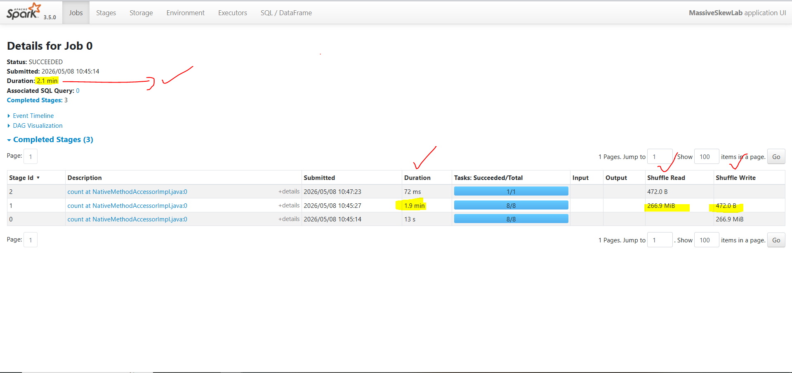
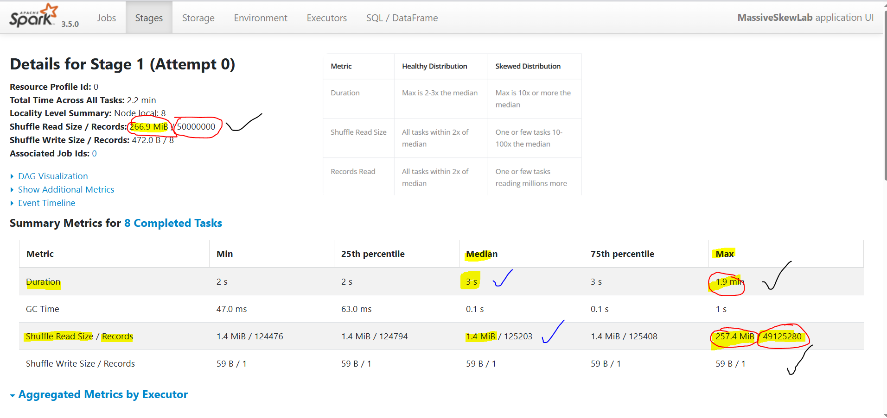
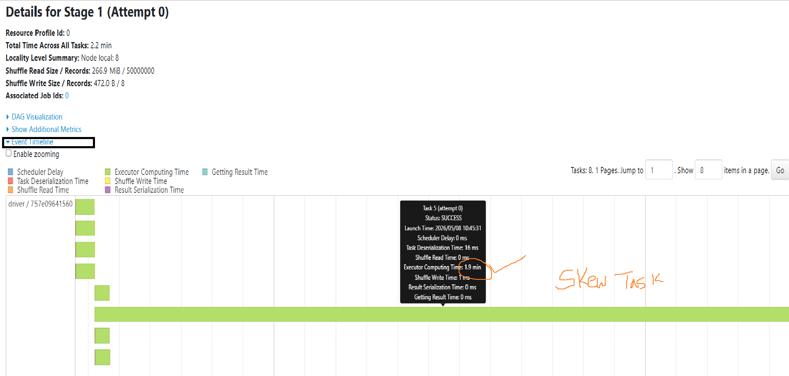
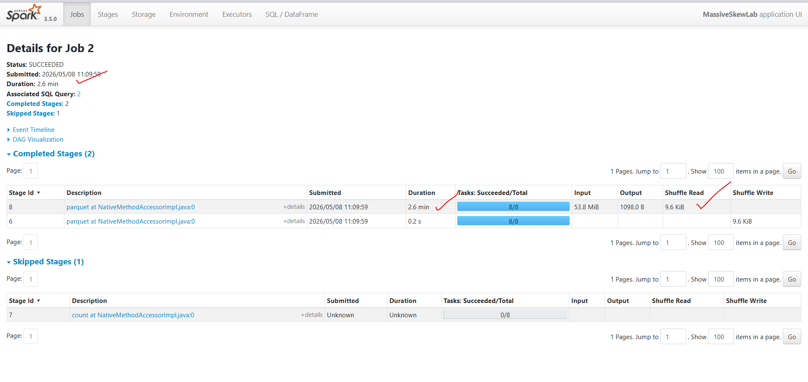
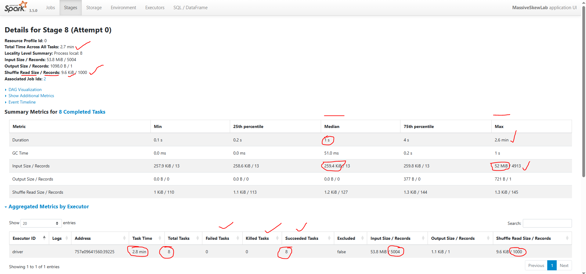
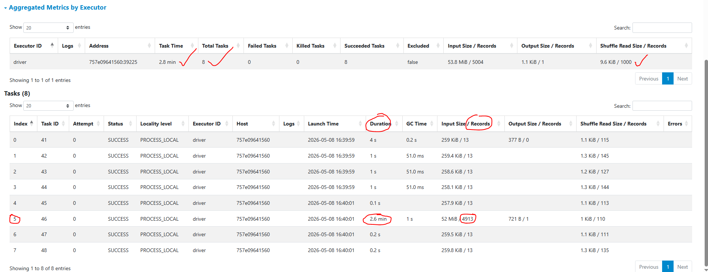
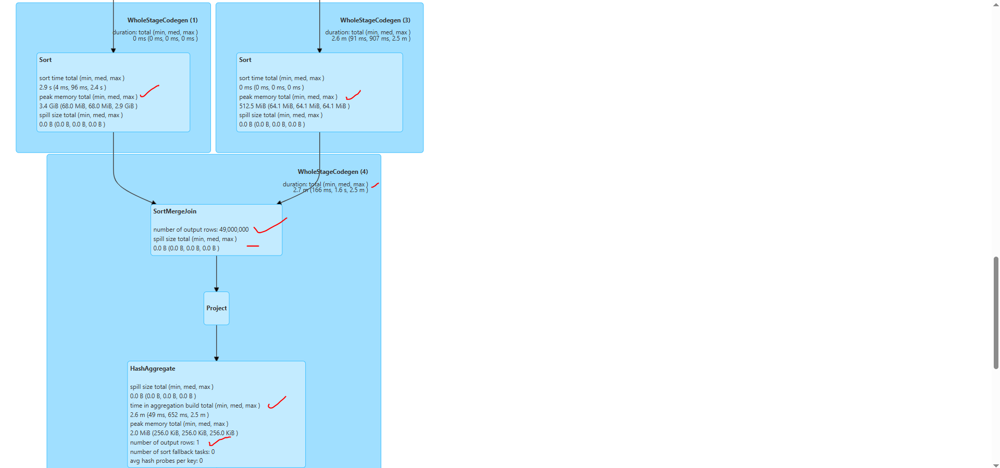
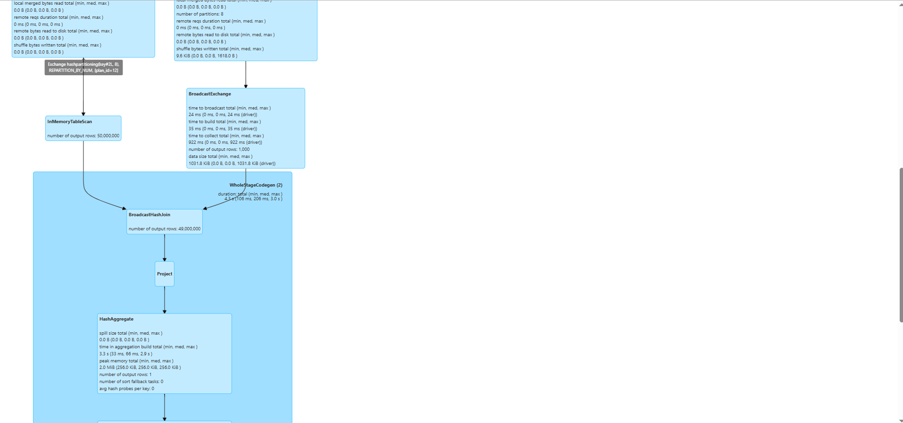
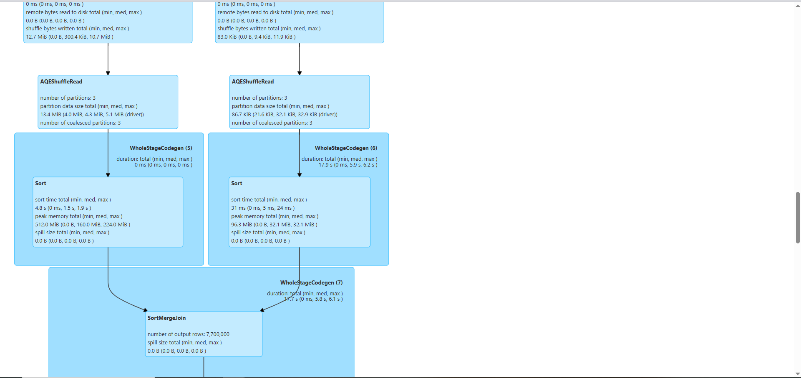
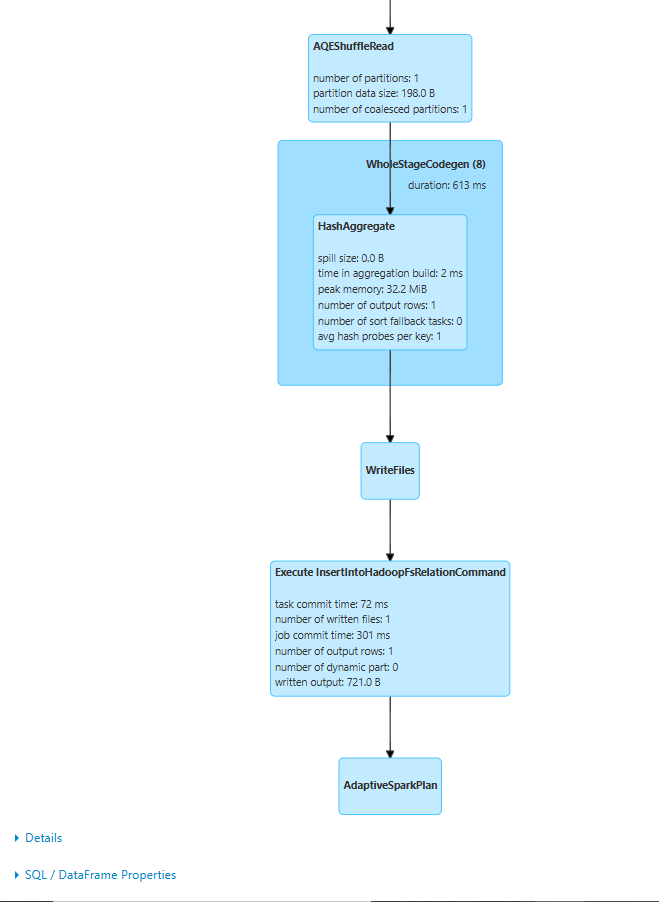

**⚡ Code Demos **
 *[ DataSkew Code Example on Local Spark](Data_Skew_LAB.ipynb) 

**⚡ Read Further **
  * [SPARK UI Decoded](https://spark.apache.org/docs/3.5.6/web-ui.html)
  * [A Deep Dive into Spark UI for Job Optimization](https://techcommunity.microsoft.com/blog/microsoftmissioncriticalblog/a-deep-dive-into-spark-ui-for-job-optimization/4442229)

 **⚡ YT Video on this **
* [Why Data Skew Will Ruin Your Spark Performance](https://www.youtube.com/watch?v=9Ss-_y7njKE)
* [How Salting Can Reduce Data Skew By 99%](https://youtu.be/rZGsc5y8AQk)
* [Broadcast Joins & AQE (Adaptive Query Execution)](https://youtu.be/bRjVa7MgsBM)

- **⚡ Collection of SPARK UI Images for Reference of SKEW Issues**

